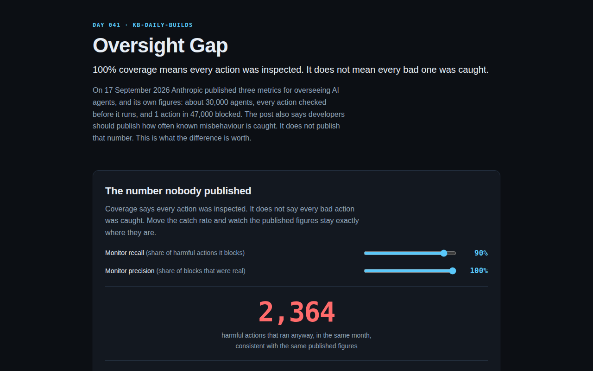

<div align="center">

# Oversight Gap

**100% coverage means every action was inspected. It does not mean every bad one was caught.**

[](https://github.com/kbipul/oversight-gap/actions/workflows/ci.yml)
[](https://kbipul.github.io/oversight-gap/)

`Day 041` of **[kb-daily-builds](https://github.com/kbipul/kb-daily-builds)** — one AI project a day.

</div>

## What it does

On 17 September 2026 the Anthropic Institute published three metrics for overseeing AI agents, along with its own figures: roughly 30,000 agents on one internal platform, every action through a monitor before it runs, and `0.002% of them (about 1 in 47,000)` blocked across over a billion August decisions. The same post says developers "should share how often known agent misbehavior is caught by monitors". It does not share that number.

This app makes the size of that omission movable. Drag the catch rate and the count of harmful actions that ran anyway swings from zero to six figures, while every metric actually published (coverage, latency, the block count) sits still. It also does three pieces of arithmetic on the published table: the block rate is printed two ways that are 6% apart, the one-week human review promise implies a standing queue of about 4,800 blocked actions a week, and the offline flag volume and flag rate imply a transcript population that sits oddly against 30,000 agents.



<sub>The sandbox that builds these projects has no browser, so it cannot screenshot. The repo's CI captures `docs/demo.png` on a GitHub runner and commits it back, usually within minutes of publish.</sub>

## Try it

**[Live demo →](https://kbipul.github.io/oversight-gap/)** — runs fully in your browser, nothing to install, no key.

```bash
git clone https://github.com/kbipul/oversight-gap.git
cd oversight-gap
npm ci
npm test          # 33 tests
npm run dev       # http://localhost:5173/oversight-gap/
```

## How it works

Where the judgement calls are.

### Published figures are quoted, not paraphrased

`src/oversight/figures.ts` carries each number with the verbatim sentence it came from and the scope caveat Anthropic attaches to it, and the scope line travels with the number into the UI. A figure the post did not publish is absent from that file rather than estimated. One test asserts the absence directly: nothing in `PUBLISHED` matches `/catch|recall|false.negative/i`.

### The inference is one function

`bandFor()` in `src/oversight/band.ts` takes an action count, an observed block rate, a coverage share, and the two unknowns, precision and recall. It returns a ledger that labels each row observed or inferred:

```
blocked            = actions × blockRate            (observed)
trueBlocks         = blocked × precision            (inferred)
harmfulMonitored   = trueBlocks ÷ recall            (inferred)
missedMonitored    = harmfulMonitored − trueBlocks  (inferred)
missedUnmonitored  = uninspected × harmfulRate      (inferred)
```

At recall 1.0 the last two rows are zero. At 0.1 they are nine times the block count. `observedSignature()` exists so a test can assert what the UI claims: coverage and blocked are byte-identical across that whole range.

### Recall zero is clamped, not shown

A monitor with zero recall cannot have produced the observed blocks, so the inference divides by zero. `MIN_RECALL = 0.01` is the floor, a test pins the clamp, and the slider stops there rather than printing Infinity at people.

## Build notes — what I learned

Two tests failed on the first run and both times the test was wrong, which is a better outcome than it sounds. `expected 191493 to be 191489` came from an assertion written as `9 * Math.round(r.blocked)` against a value computed as `Math.round(9 * r.blocked)`. One billion divided by 47,000 is 21,276.59, so rounding before multiplying and rounding after differ by four whole actions. The second, `expected 17021 to be 17022`, was the same mistake in miniature. I fixed the assertions and then added a third test that pins both numbers side by side, because this app's entire output is rounded action counts derived from a non-integer rate, and the order I round in is a decision I would rather have written down than rediscovered.

The scope cut I made: there is no chart. I wanted a curve of the band against recall and `sweepRecall()` is in the code with a test on it, but nothing renders it. A slider plus a ledger that relabels itself makes the same point in less space, and I would rather ship the arithmetic verified than a graph unverified. The function stays because the test earns it.

What surprised me was in the table rather than the slider. "Humans review any blocked actions within one week" reads like a service level. Multiply it out — 21,277 blocks over 31 days — and it is a commitment about roughly 4,800 items a week landing in front of people. Two rows above it, the offline monitor sends about 50 flags a week to human review. Those are both human queues in the same system and they differ by about a hundredfold, which is not a contradiction but is the kind of thing that only becomes visible when you divide.

One finding I could not close, and the app says so. The offline monitor flags "roughly 100,000 transcripts per week" at "one to two transcripts in every thousand". Those two figures imply a population of 50 to 100 million transcripts a week, which across 30,000 agents is 1,667 to 3,333 transcripts per agent per week. That is either a very fine-grained definition of "transcript" or two numbers measured over different populations. The post does not say, I could not resolve it from the text, and the panel prints the range with the verdict left open rather than picking whichever reading sounds better.

The thing I keep coming back to is how little the sliders are doing. They are not a model. There is no clever estimation in here — the whole inference is one division and one subtraction. That the answer still swings from 0 to 191,489 across a plausible range of a single unpublished parameter is the finding, and it is why the post asks for that parameter in the first place.

## What this does not do

It does not claim the monitor is bad. Recall could be 99%, in which case the honest answer is about 215 actions, and the app will show you that too. It does not measure anything: recall and precision are sliders because they are unknown, and every row downstream of them is labelled inferred. Anthropic's figures cover its most-used internal platform, not everything it runs, which is why the scope sentence is attached to each one.

## Stack

| | |
|---|---|
| UI | React 18, TypeScript 5 |
| Build | Vite 5 |
| Tests | Vitest 2, 33 tests |
| Demo | GitHub Pages, no network calls at runtime |

## Source

Marina Favaro and Phillie Wright, ["Measurements for understanding the pace of AI development inside frontier labs"](https://www.anthropic.com/institute/measuring-pace-of-ai-development), Anthropic Institute, 17 September 2026. Read 19 September 2026. Every quoted string in `figures.ts` is from that post.

---

<div align="center"><sub>
Built by <a href="https://www.kumarbipul.com"><b>Kumar Bipul</b></a> ·
IT Director → AI/ML · <a href="https://github.com/kbipul">github.com/kbipul</a>
</sub></div>
